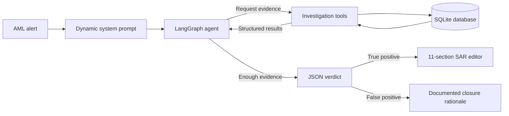

# AML SAR Investigator

> A stateful, explainable AML investigation agent that gathers evidence, classifies alerts, and helps analysts produce structured UK Suspicious Activity Reports.


The AML SAR Investigator acts as a Level 1 Anti-Money Laundering investigator. It receives a transaction alert, forms a hypothesis, queries a constrained set of internal tools, evaluates the evidence, and returns a structured `TRUE_POSITIVE`, `FALSE_POSITIVE`, or `INCONCLUSIVE` verdict.

True-positive investigations can be passed directly into an interactive SAR editor that generates an auditable, 11-section report with legal context, NCA glossary codes, citations, and analyst-controlled section generation.

## Key Features

- **Evidence-led investigations** using a cyclical LangGraph agent and five restricted database tools.
- **Explainable reasoning** with a required hypothesis, analysis, updated hypothesis, and next-step flow.
- **Structured verdicts** containing rule-mapped evidence, transaction IDs, statistical context, regulatory significance, and false-positive hypotheses.
- **Real-time streaming** of reasoning, tool calls, tool results, rate-limit notices, and verdicts through Server-Sent Events.
- **Multi-provider LLM support** for Groq, Gemini, Mistral, NVIDIA NIM, OpenRouter/DeepSeek, Cerebras, and local llama.cpp servers.
- **Groq key rotation** across comma-separated API keys when a provider rate limit is reached.
- **Watchlist screening** with exact, alias, and fuzzy matching for customers and counterparties.
- **Interactive SAR generation** with deterministic administrative sections and focused LLM generation for narrative sections.
- **Explainability inspector** for inline evidence citations, rationale markers, raw prompts, and generation diagnostics.
- **Visual rules editor** for AML rules, NCA glossary codes, and legal snippets without changing Python code.

## Technology Stack

| Layer | Technology |
| --- | --- |
| Agent and models | LangGraph, LangChain, and provider-specific chat integrations |
| API and streaming | FastAPI, Uvicorn, and Server-Sent Events |
| Data and validation | SQLite, CSV seed data, and Pydantic |
| Frontend | Jinja2, Tailwind CSS, Vanilla JavaScript, markdown-it, and DOMPurify |
| Testing | pytest |

## How It Works



The graph alternates between two nodes:

1. The **agent node** evaluates the alert and accumulated evidence, then either requests another tool or completes the investigation.
2. The **tools node** executes the requested database operation and appends its structured result to the shared state.

Python performs deterministic calculations such as totals, income multiples, retention ratios, dormancy, rapid outflows, and transaction sampling. The LLM is responsible for evidence interpretation and narrative construction rather than raw arithmetic.

## Investigation Tools

| Tool | Purpose |
| --- | --- |
| `get_customer_profile` | Retrieves KYC, income, occupation, PEP, sanctions, risk, and document status. |
| `get_account_summary` | Retrieves customer accounts, balances, activity dates, and dormancy signals. |
| `get_transaction_history` | Aggregates transactions and detects structuring, rapid movement, jurisdiction, and retention signals. |
| `get_prior_alert_history` | Reviews earlier dispositions and checks whether a SAR would duplicate a prior filing. |
| `screen_watchlist` | Matches names by exact value, alias, or fuzzy token overlap and returns compliance flags. |

Transaction sampling preserves high-risk jurisdiction transfers and prioritizes sub-threshold credits when structuring is detected, ensuring the verdict retains the most relevant transaction IDs.

## AML Rules

| Rule | Typology |
| --- | --- |
| `RULE-01` | Structuring / smurfing |
| `RULE-02` | Rapid movement of funds |
| `RULE-03` | High-risk jurisdiction transfer |
| `RULE-04` | Transaction-profile mismatch |
| `RULE-05` | Dormant account reactivation |
| `RULE-06` | Third-party funding |
| `RULE-07` | PEP / sanctions proximity |
| `RULE-08` | Round tripping / layering |

Only rules listed in an alert are injected into its system prompt. This keeps investigations focused and reduces irrelevant rule contamination.

## SAR Generation

For a `TRUE_POSITIVE` verdict, the dashboard hands the structured evidence to the SAR editor. Analysts can generate sections sequentially or select individual sections.

| Sections | Generated content |
| --- | --- |
| 1-2 | Deterministic filing particulars and subject identification, populated from verified data. |
| 3 | NCA glossary code identification followed by a separate narrative-generation pass. |
| 4-5 | Customer profile, income comparison, and a chronological transaction narrative. |
| 6 | Per-rule regulatory analysis followed by statutory and case-law context. |
| 7-9 | Watchlist results, statistical analysis, and assessment of innocent explanations. |
| 10-11 | Prior SAR history, duplicate-filing safety, and DAML determination where required. |

Generated Markdown is shown in raw and rendered views. The preview is sanitized with DOMPurify, while citations and reasoning tags can be inspected through the XAI mode. A client-side state machine tracks each section as `pending`, `generating`, `done`, or `error` and prevents overlapping generation requests.

## Quick Start

### Prerequisites

- Python 3.10 or later
- An API key for one supported hosted provider, or a running llama.cpp OpenAI-compatible server

### 1. Create a virtual environment

```bash
python -m venv .venv
```

Activate it:

```powershell
# Windows PowerShell
.\.venv\Scripts\Activate.ps1
```

```bash
# Linux or macOS
source .venv/bin/activate
```

### 2. Install dependencies

```bash
pip install -r requirements.txt
```

### 3. Configure the environment

```powershell
# Windows PowerShell
Copy-Item .env.example .env
```

```bash
# Linux or macOS
cp .env.example .env
```

Set `LLM_PROVIDER`, optionally set `LLM_MODEL`, and add the matching API key in `.env`.

### 4. Build the local database

```bash
python data/scripts/create_schema.py
python data/scripts/seed_database.py
```

These scripts create `data/aml_synthetic.db` and seed it from the CSV files under `data/csv/`.

### 5. Verify the tools

```bash
python -m pytest tests/test_tools.py -v
```

### 6. Start the application

```bash
uvicorn api:app --reload
```

Open `http://127.0.0.1:8000` to use the investigation dashboard.

## Running an Investigation

Use either of the included samples from the command line:

```bash
python run_investigation.py tests/sample_alerts/true_positive.json
python run_investigation.py tests/sample_alerts/false_positive.json
```

The runner prints the active provider and model, streams the investigation, and extracts the final JSON verdict even when a provider wraps it in additional text.

You can also submit an alert to the API:

```bash
curl -N -X POST http://127.0.0.1:8000/investigate \
  -H "Content-Type: application/json" \
  --data @tests/sample_alerts/true_positive.json
```

The stream emits events such as `thinking`, `tool_call`, `tool_result`, `rate_limit`, `system_prompt`, and `verdict`.

## Application Routes

| Route | Description |
| --- | --- |
| `GET /` | Investigation dashboard and sample-alert selector. |
| `POST /investigate` | Streams a new investigation through SSE. |
| `GET /sar-editor` | Interactive SAR document workspace. |
| `POST /generate-section/{section_id}` | Streams one SAR section on demand. |
| `GET /rules-editor` | Visual editor for compliance configuration. |
| `GET /api/alerts` | Lists bundled true-positive and false-positive samples. |
| `GET /health` | Basic service health check. |
| `GET/PUT /api/rules/*` | Reads or updates AML rules, glossary codes, and legal snippets. |

The API also exposes evidence lookup routes for watchlists, transactions, and supported database records, which power citation inspection in the frontend.

## LLM Configuration

| Provider value | Default model | Required setting |
| --- | --- | --- |
| `groq` | `llama-3.3-70b-versatile` | `GROQ_API_KEY` or `GROQ_API_KEYS` |
| `gemini` | `gemini-2.5-flash` | `GEMINI_API_KEY` |
| `mistral` | `mistral-large-latest` | `MISTRAL_API_KEY` |
| `nvidia` | `deepseek-ai/deepseek-v3.1` | `NVIDIA_API_KEY` |
| `deepseek` | `deepseek/deepseek-chat` through OpenRouter | `OPENROUTER_API_KEY` |
| `cerebras` | `qwen-3-235b-a22b-instruct-2507` | `CEREBRAS_API_KEY` |
| `llamacpp` | Model loaded by the local server | `LLAMACPP_HOST` (optional) |

Use `LLM_MODEL` to override a provider default. Groq accepts comma-separated keys and rotates to the next key after a `429` response. For llama.cpp, the default host is `http://localhost:8080` and no real API key is required.

Additional configuration:

| Variable | Description | Default |
| --- | --- | --- |
| `LLM_PROVIDER` | Active model provider. | `groq` |
| `LLM_MODEL` | Optional provider-specific model override. | Provider default |
| `DB_PATH` | SQLite database location. | `data/aml_synthetic.db` |

## Dynamic Compliance Configuration

Compliance content is stored outside the prompt source and loaded at runtime:

- `config/aml_rules.json` defines rule triggers and evidence requirements.
- `config/glossary_codes.json` maps rules to NCA UKFIU glossary codes.
- `config/legal_snippets.json` stores rule-specific, always-present, case-law, and sanctions context.

`agent/config_manager.py` provides synchronized, atomic access to these files. The `/rules-editor` interface offers form-based editing, tracks unsaved changes, and writes updates through the `/api/rules/*` endpoints.

## Project Structure

```text
.
|-- agent/
|   |-- graph.py                 # LangGraph investigation loop
|   |-- llm.py                   # Provider factory and Groq key rotation
|   |-- prompts.py               # Dynamic investigation prompt and evidence rules
|   |-- runner.py                # Cross-provider CLI streaming
|   |-- sar_generator.py         # Section-based SAR generation
|   |-- sar_prompts.py           # SAR narrative prompts
|   |-- config_manager.py        # Runtime compliance configuration
|   `-- legal_context_builder.py # Rule-scoped legal context
|-- config/                      # AML rules, glossary codes, and legal snippets
|-- data/
|   |-- csv/                     # Synthetic source data
|   `-- scripts/                 # Database creation and seeding
|-- schemas/                     # Pydantic alert and verdict models
|-- templates/                   # Dashboard, SAR editor, rules editor, and UI modules
|-- tests/                       # Tool tests and sample alerts
|-- tools/internal/              # Constrained investigation tools
|-- api.py                       # FastAPI application and SSE endpoints
|-- run_investigation.py         # CLI entry point
|-- Implementation.md            # Detailed design and implementation notes
`-- requirements.txt
```

## Design Principles

- **Constrained access:** the model never queries SQLite directly and can only call documented tools with explicit parameters.
- **Specific evidence:** findings must cite exact values, counts, dates, counterparties, and calculated comparisons.
- **Complete rule coverage:** every triggered rule requires its own evidence entry, without reusing transaction IDs across entries.
- **Source separation:** watchlist evidence remains distinct from transaction evidence, especially for `RULE-07`.
- **Auditable output:** the dashboard can retain the full prompt, reasoning, tool path, results, and verdict for review.
- **Focused generation:** deterministic data, compliance-code selection, legal analysis, and narrative writing are handled in separate stages.

## Notes

This repository uses synthetic data and is intended as a development and demonstration system. AI-generated AML decisions and SAR text require review by qualified compliance professionals before operational or regulatory use.

For deeper implementation details and design rationale, see [Implementation.md](Implementation.md).
